# Try Hack Me Writeup - Hydra

THM Room is here: https://tryhackme.com/room/hydra

This writeup of the hydra room is fully detailed with screenshots, as this is so fun to do. I found it also funny to document the whole process. With some extra information you wouldn't find in the other writeup's or even the walk through YouTube video on top of this room.

## Task 1 - Hydra Introduction

Hydra is a brute force online password cracking program; a quick system login password 'hacking' tool.

We can use Hydra to run through a list and 'bruteforce' some authentication service. Imagine trying to manually guess someones password on a particular service (SSH, Web Application Form, FTP or SNMP) - we can use Hydra to run through a password list and speed this process up for us, determining the correct password.

Hydra has the ability to bruteforce the following protocols: Asterisk, AFP, Cisco AAA, Cisco auth, Cisco enable, CVS, Firebird, FTP,  HTTP-FORM-GET, HTTP-FORM-POST, HTTP-GET, HTTP-HEAD, HTTP-POST, HTTP-PROXY, HTTPS-FORM-GET, HTTPS-FORM-POST, HTTPS-GET, HTTPS-HEAD, HTTPS-POST, HTTP-Proxy, ICQ, IMAP, IRC, LDAP, MS-SQL, MYSQL, NCP, NNTP, Oracle Listener, Oracle SID, Oracle, PC-Anywhere, PCNFS, POP3, POSTGRES, RDP, Rexec, Rlogin, Rsh, RTSP, SAP/R3, SIP, SMB, SMTP, SMTP Enum, SNMP v1+v2+v3, SOCKS5, SSH (v1 and v2), SSHKEY, Subversion, Teamspeak (TS2), Telnet, VMware-Auth, VNC and XMPP.

For more information on the options of each protocol in Hydra, read the official Kali Hydra tool page: https://en.kali.tools/?p=220

This shows the importance of using a strong password, if your password is common, doesn't contain special characters and/or is not above 8 characters, its going to be prone to being guessed. 100 million password lists exist containing common passwords, so when an out-of-the-box application uses an easy password to login, make sure to change it from the default! Often CCTV camera's and web frameworks use admin:password as the default password, which is obviously not strong enough.

Installing Hydra
If you're using Kali Linux, hydra is pre-installed. Otherwise you can download it here: https://github.com/vanhauser-thc/thc-hydra

If you don't have Linux or the right desktop environment, you can deploy your own Kali Linux machine with all the needed security tools. You can even control the machine in your browser! Do this with our Kali room - https://tryhackme.com/room/kali

### Read the above and have Hydra at the ready

```
No answer needed
```

## Task 2 - Using Hydra

Deploy the machine attached to this task, then navigate to http://<ip-thm-virtual-machine> (this machine can take up to 3 minutes to boot)

### Hydra Commands

The options we pass into Hydra depends on which service (protocol) we're attacking. For example if we wanted to bruteforce FTP with the username being user and a password list being passlist.txt, we'd use the following command:

```commandline
hydra -l user -P passlist.txt ftp://<ip-thm-virtual-machine>
```

For the purpose of this deployed machine, here are the commands to use Hydra on SSH and a web form (POST method).

### SSH

```commandline
hydra -l <username> -P <full path to pass> <ip-thm-virtual-machine> -t 4 ssh
```


### Post Web Form

We can use Hydra to bruteforce web forms too, you will have to make sure you know which type of request its making - a GET or POST methods are normally used. You can use your browsers network tab (in developer tools) to see the request types, or simply view the source code.

Below is an example Hydra command to brute force a POST login form:

```commandline
hydra -l <username> -P <wordlist> <ip-thm-virtual-machine> http-post-form "/:username=^USER^&password=^PASS^:F=incorrect" -V
```

You should now have enough information to put this to practise and brute-force yourself credentials to the deployed machine!

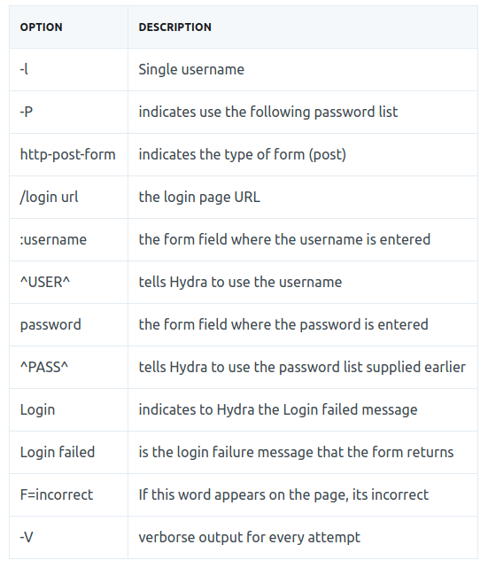

### Answer the questions below

#### Use Hydra to bruteforce molly's web password. What is flag 1? 

    THM{2673a7dd116de68e85c48ec0b1f2612e}

#### Use Hydra to bruteforce molly's SSH password. What is flag 2?

    THM{c8eeb0468febbadea859baeb33b2541b}

## My Information Gathering and Attacks

So I booted up that virtual machine. And like requested I browsed to that web server which present a login screen.


The first thing to do is to look up what services are running on that machine. To be sure we have a good view of what's going on. So I ran a `nmap` scan on all ports with OS information gathering and which resulted into this:

```commandline
┌──(root💀vm-dsktp-kali)-[/home/itchy]
└─# nmap -p- -A 10.10.180.225
Starting Nmap 7.91 ( https://nmap.org ) at 2021-07-30 17:46 CEST
Nmap scan report for 10.10.180.225
Host is up (0.034s latency).
Not shown: 65533 closed ports
PORT   STATE SERVICE VERSION
22/tcp open  ssh     OpenSSH 7.2p2 Ubuntu 4ubuntu2.8 (Ubuntu Linux; protocol 2.0)
| ssh-hostkey: 
|   2048 28:5e:e8:8e:e3:81:da:03:0a:a2:de:3c:aa:6e:6f:0a (RSA)
|   256 97:98:2e:83:c9:68:5b:29:51:64:20:e6:3b:ea:c4:c6 (ECDSA)
|_  256 42:96:68:b4:8e:95:e1:57:91:3e:bf:b1:3c:cf:67:dd (ED25519)
80/tcp open  http    Node.js Express framework
| http-title: Hydra Challenge
|_Requested resource was /login
No exact OS matches for host (If you know what OS is running on it, see https://nmap.org/submit/ ).
TCP/IP fingerprint:
OS:SCAN(V=7.91%E=4%D=7/30%OT=22%CT=1%CU=30405%PV=Y%DS=2%DC=T%G=Y%TM=61041EE
OS:9%P=x86_64-pc-linux-gnu)SEQ(SP=104%GCD=1%ISR=10C%TI=Z%CI=I%II=I%TS=8)OPS
OS:(O1=M505ST11NW7%O2=M505ST11NW7%O3=M505NNT11NW7%O4=M505ST11NW7%O5=M505ST1
OS:1NW7%O6=M505ST11)WIN(W1=68DF%W2=68DF%W3=68DF%W4=68DF%W5=68DF%W6=68DF)ECN
OS:(R=Y%DF=Y%T=40%W=6903%O=M505NNSNW7%CC=Y%Q=)T1(R=Y%DF=Y%T=40%S=O%A=S+%F=A
OS:S%RD=0%Q=)T2(R=N)T3(R=N)T4(R=Y%DF=Y%T=40%W=0%S=A%A=Z%F=R%O=%RD=0%Q=)T5(R
OS:=Y%DF=Y%T=40%W=0%S=Z%A=S+%F=AR%O=%RD=0%Q=)T6(R=Y%DF=Y%T=40%W=0%S=A%A=Z%F
OS:=R%O=%RD=0%Q=)T7(R=Y%DF=Y%T=40%W=0%S=Z%A=S+%F=AR%O=%RD=0%Q=)U1(R=Y%DF=N%
OS:T=40%IPL=164%UN=0%RIPL=G%RID=G%RIPCK=G%RUCK=G%RUD=G)IE(R=Y%DFI=N%T=40%CD
OS:=S)

Network Distance: 2 hops
Service Info: OS: Linux; CPE: cpe:/o:linux:linux_kernel

TRACEROUTE (using port 1720/tcp)
HOP RTT      ADDRESS
1   29.92 ms 10.8.0.1
2   30.24 ms 10.10.180.225

OS and Service detection performed. Please report any incorrect results at https://nmap.org/submit/ .
Nmap done: 1 IP address (1 host up) scanned in 40.33 seconds
```

**_It's always good to do a nmap scan on these virtual machine in TryHackMe. Because my first scan didn't show the ssh server. Sometimes, it takes quick a few minutes before all services are up and running. This can lead to confession. So do not hesitate to launch a second scan. Everything (almost) is permitted here anyway in this test LAB_**

According to the information, in the questions whe have, we know it's about the user `molly`. Luckily we have this information or it would have been a real nightmare.

As our challenge is about a webserver APP. We need to work on our Information Gathering about that Web App.

Take for example a look to the `Firefox Wappalyzer` Add-on. This can give us information about what this website use. This is completely optional and even useless in this case, but just to feed our curiosity. Let's install and use this.

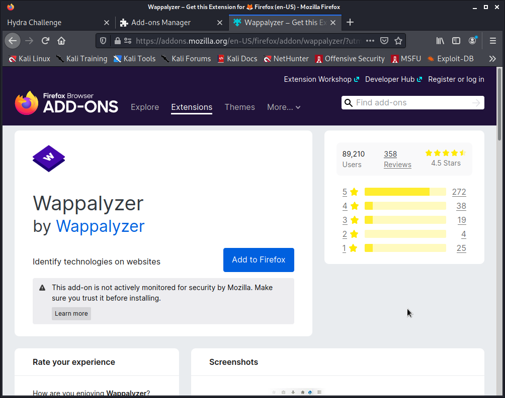

After installation, just click that `Wappalyer` icon and your get some information of what this website uses.

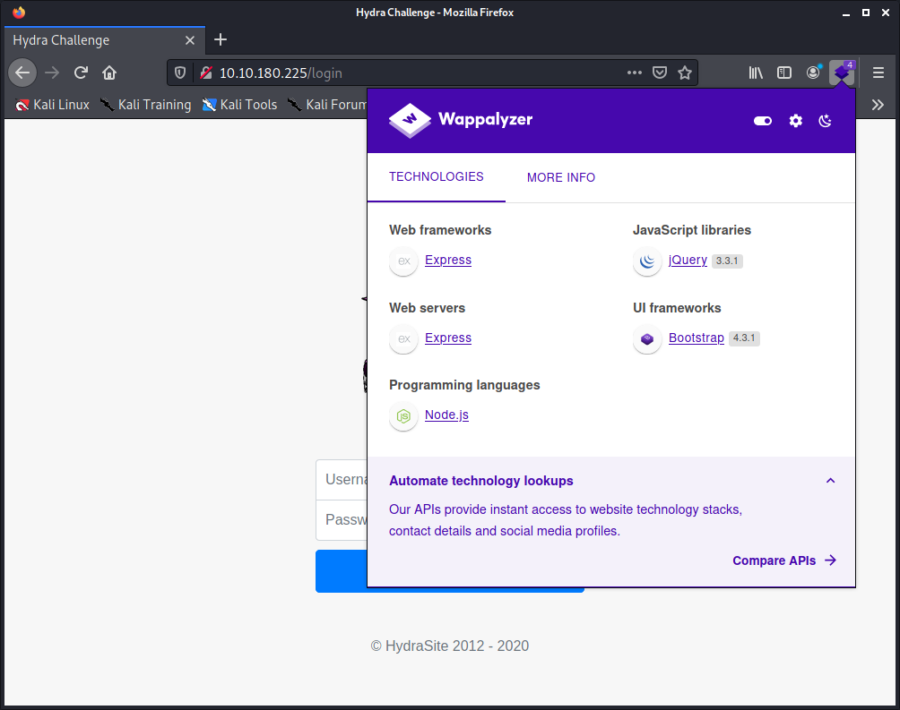

We also want to know how this user and password input fields are used. Also, we want to know what error message the web app gives us when the log in attempt fails. This is very crucial as we don't own super cow power and we have no clue how things work behind the scenes. Our job is to do research, so let's do it!

For this we can use 2 interesting tools. `FoxyProxy` and `Burp Suite`.

The `FoxyProxy` is a little `Firefox` Add-on to manage different proxy settings. This to avoid to each time to go to the browser settings, set manually the proxy settings during our experimentation's and to finally, set back to the defaults when we're done. So let's make use of `FoxyProxy` so that we can configure it to send the data to the `Burp Suite`, which will give us information on what's hopping behind the scene. Hold on, it's abstract stuff right now, but things will get clear in a few. So let's start by installing the `FoxyProxy` addon.


After installing this `ProxyFoxy` Add-on, we have a new icon. We need to configure this proxy tool and create a dedicated proxy setting for our `Burp Suite`. So click on `Options`.

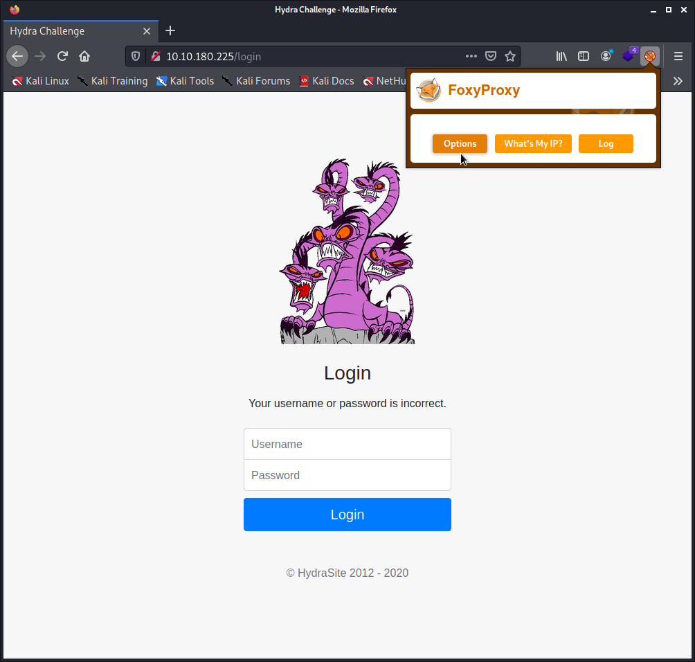

Click on the `Add` button.

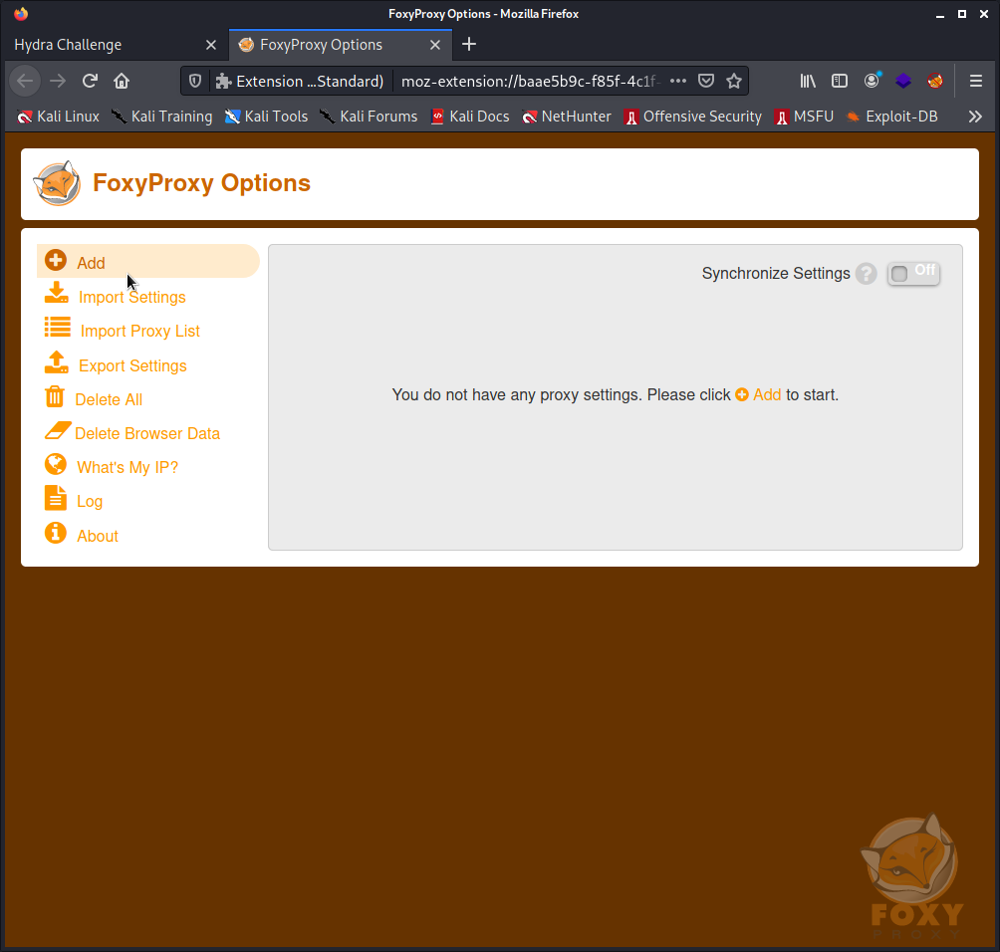

Give in a logical name, `Burp` is perfect, the proxy IP of `127.0.0.1` and the port `8080` and finally press the `Save` button.


The settings are saved. So we can move to the next step.


Enable the Proxy setting for `Burp`.


If you try to reload our login form, you will see that there's no internet access anymore. As the browser is now configured to use a Proxy server located on port `127.0.0.1` and port number `8080`. But for the moment, there's nothing that handle this. So let's start `Blurp Suite` which will do act like a proxy server to intercept the data.

When starting up `Burp suite`, I get some warning about JRE stuff, but I'm to lazy to read and i'm not good with Java stuff anyway, so I just press the `OK` button :-D In fact, it's a matter about the open source software Java JRE which all people hate. But let's move on and not debate on this.

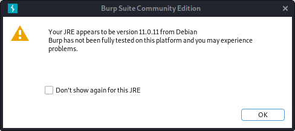

Then we get a bunch of Start Project alike screens. Which we don't mind, we are not going to make a project here, just make quick good use of the `Burp Suite`. So leave the `Temporary project` options selected as is and press `Next`.

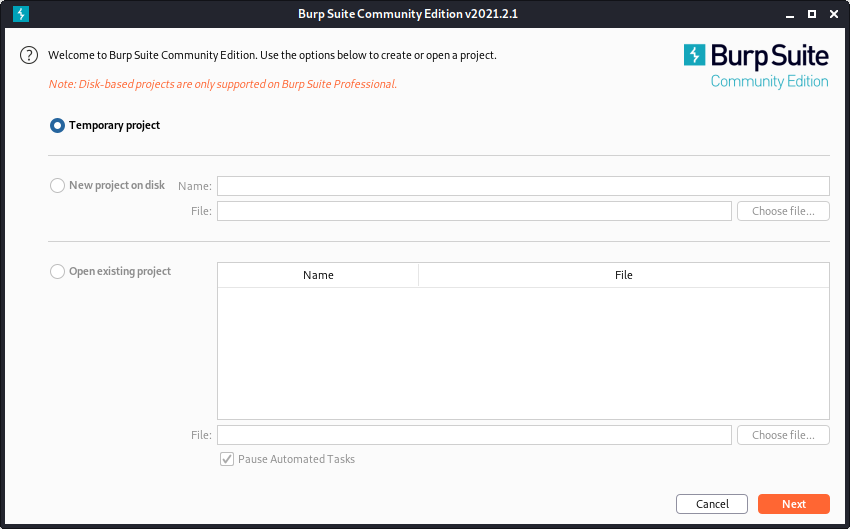

We have no configuration file to load, so leave the option Use `Burp defaults` and press `Start Burp`.

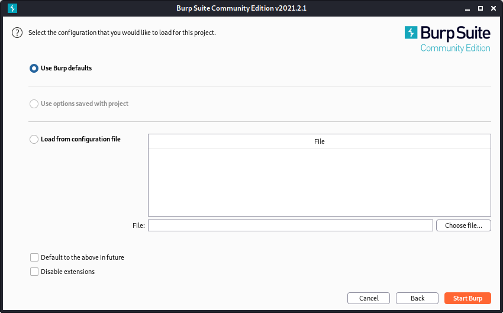

Go to the `Proxy` tab, and click on the button `Intercept is off` to turn on intercepting the data.

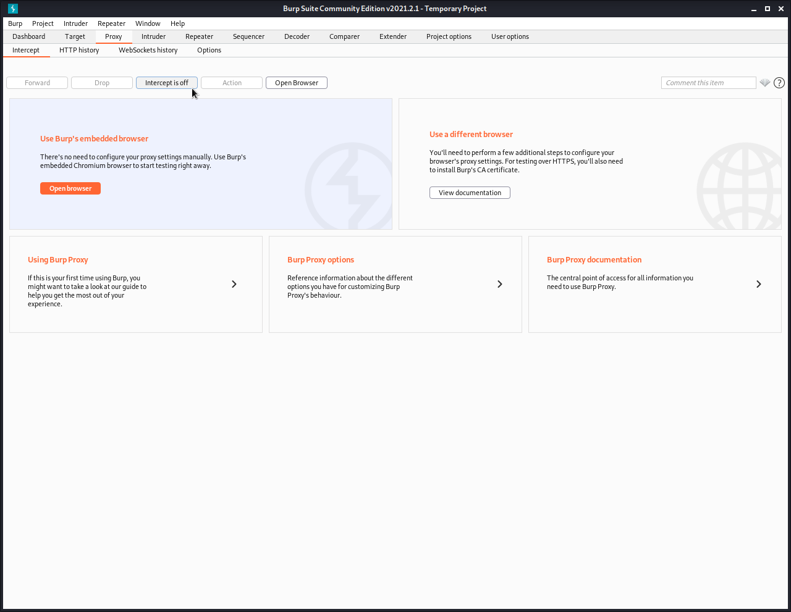

We are ready to go!

We can go back to our http://10.10.180.225/login and fill in whatever our inspiration has. We need to fill in a username and password. It's your turn creative man! Then press the `Login` button.

**NOTE: You will see that the website looks like not wanting to load anymore. No Internet anymore? Which is true, because we have set up the Burp Suite proxy feature. But the Burp Suite needs some intervention at this stage.**

We now need to go back to our `Burp Suite` application, and we will already get useful information about the username and the password we have entered. We don't care about the username and the password, as this is out of the blue of our imagination. However, the important things is how the web APP form fields are transmitted from one page to another. The part `username=admin&password=SuperCowPower` is what we are looking for. This looks stupid, but you never know what a web developer gave as synonyms to these two arguments. Better be sure and to check, that's information gathering!

The next step is to press the `Forward` button in the `Burp Suite`, twice in fact in this case. So that he forward back the data to our Firefox browser, which then is sent back to the Web APP and so that we see our login error message.


Interesting to see that our error message is: `Your username or password is incorrect.` This is crucial information we need to know and to use when we will fire up `hydra` to launch our web APP Attack.


Our Information Gathering is over. We know enough for now, and we are ready for the web app bruteforce Wep APP attack.

**Don't forget to turn off the `interception` in `Blurp suite` and the `ProxyFoxy` settings  in `Firefox` ;-)**

As we are going to use `hydra`. We need a word list with common used passwords to do our dictionary attack. So I will use that famous `rockyou.txt` words (passwords) list that is provided by default in a `Kali` installation. You should read the story of this `rockyou.txt` file here which is very interesting. This really rock!: https://en.wikipedia.org/wiki/RockYou 

So first thing I want to do is extract that damn compressed words list file `/usr/share/wordlists/rockyou.txt.gz` as using this word list like is, will give us troubles with our tools. Please, Kali, why did you do this? :-D To save 85MB? To save the planet? :-P

```commandline
cd /usr/share/wordlists/
# Preserver the original file with -k, I do not know why, to save the planet?
gunzip -k rockyou.txt.gz
```

So now we are ready to bruteforce attack that web form with our username and wordlist:

```commandline
hydra -l molly -P /usr/share/wordlists/rockyou.txt 10.10.180.225 http-post-form "/login:username=^USER^&password=^PASS^:Your username or password is incorrect." -V
```

After a few seconds, not to long actually, we found what we need, the password `sunshine` of user `molly`.

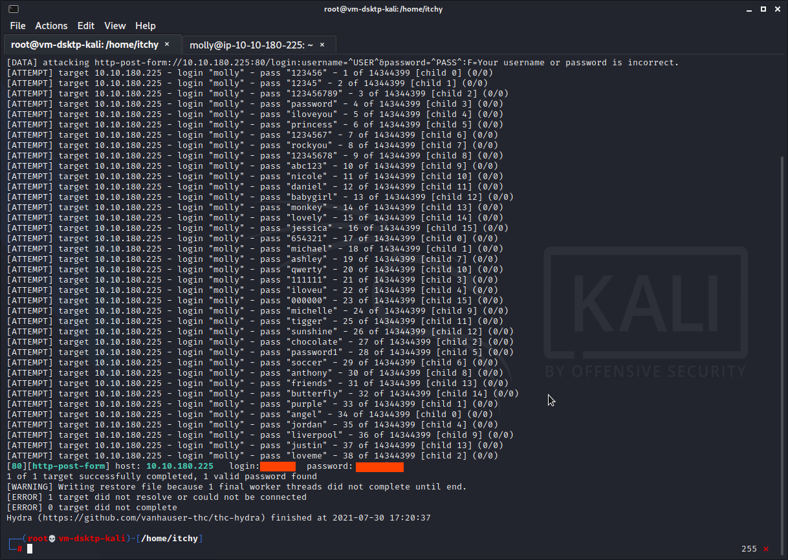

Let's login on the Web APP with these credentials!

These guys behind TryHackMe are incredible! :-D

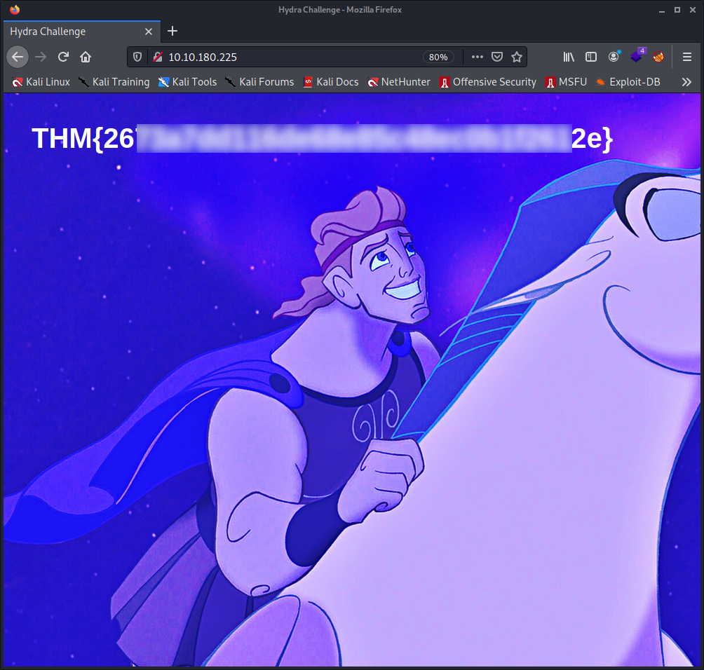

So here we go, first step is done!

We can now bruteforce the ssh server! Yes Baby!!!

```commandline
hydra -l molly -P /usr/share/wordlists/rockyou.txt 10.10.180.225 ssh -V -I
```

It took no time to bruteforce this ssh server, unbelievable.


So now lets log in with `molly`'s account onto the ssh server and look for, I do not know yet:


This was easy and very interesting!

# Defensive Security Recommendations

* For sure, a strong password policy is not a must, but a requirement. Like we have seen. A password that is not strong enough and know like in the `rockyou.txt` file is guessed in a few seconds.
  * **Audit** - Try to crack / guess your passwords.
  * **Password Policy** - A requirement to have alphanumeric, digits, special characters in the password. A minimum of password length should be nice too. Something's like 12 characters long or more. Good luck brain!
* Make use of tools which monitor essential logs. Something's like the `fail2ban` app for GNU/Linux servers (but also clients). After a few (by default 3) failed login attempts for a `sshd` server, it will ban that attackers ip address. By default, it will also "unlock" the attackers ip after a few minutes. This can be configured not to do so.  `fail2ban` come with by default a few filter expressions for monitoring the logs of various services such as `sshd`, `Apache`, `proftpd`, `sasl`, etc. And on top of this, configuration can be easily extended for monitoring any other (log) text files. Fail2ban can be adopted to be used with a variety of files and firewalls. Checkout the official website for more information: https://www.fail2ban.org
